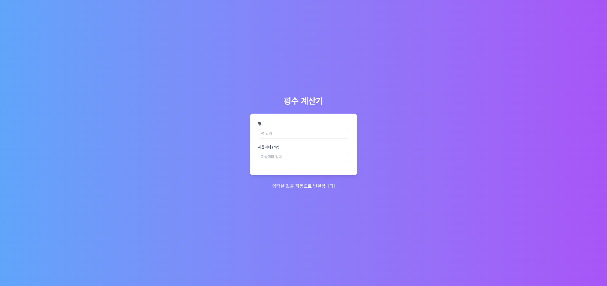
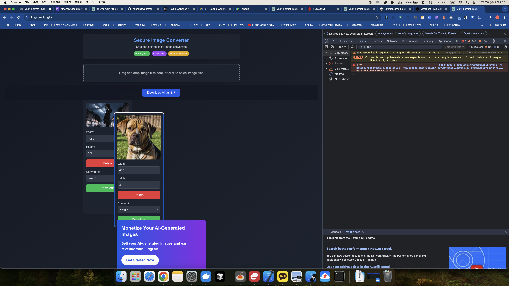
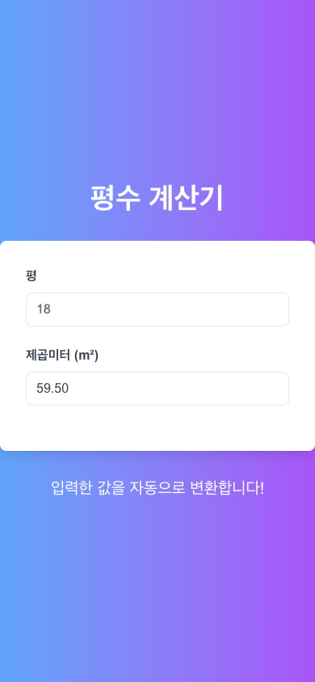

# 평수 계산기 프로젝트

서비스 링크: https://pyeong.ludgi.ai/

- ludgi.ai 홍보용 평수 계산기 프로젝트

# sitemap 확인

https://pyeong.ludgi.ai/sitemap.xml

# AWS WAF와 Shield 설정을 추후에 하기 위한 메모

WAF와 Shield의 주요 기능을 다시 한번 요약해 드리겠습니다:

1. AWS WAF:

   - SQL 인젝션, 크로스-사이트 스크립팅(XSS) 등의 일반적인 웹 공격 차단
   - IP 주소 기반의 액세스 제어
   - 지리적 위치 기반 액세스 제한
   - 요청 속도 제한 (rate-based rules)
   - 사용자 정의 규칙을 통한 특정 요청 패턴 차단

2. AWS Shield:
   - Standard: 모든 AWS 고객에게 무료로 제공되며, 가장 일반적이고 자주 발생하는 네트워크 및 전송 계층 DDoS 공격으로부터 보호
   - Advanced: 더 큰 규모의 DDoS 공격에 대한 추가 보호, 실시간 공격 가시성, 24/7 DDoS 대응팀 액세스 등 제공

이미 이러한 서비스들이 설정되어 있다면, 과도한 새로고침이나 비정상적인 트래픽에 대한 기본적인 보호는 이루어지고 있을 것입니다. 하지만 특정 요구사항에 맞게 추가적인 조정이 필요할 수 있습니다:

1. WAF 규칙 검토 및 조정:

   - 현재 설정된 규칙들을 검토하고, 필요에 따라 새로운 규칙을 추가하거나 기존 규칙을 조정합니다.
   - 예를 들어, 특정 시간 내에 허용되는 최대 요청 수를 조정할 수 있습니다.

2. CloudWatch를 통한 모니터링:

   - WAF 및 Shield의 로그를 CloudWatch와 연동하여 트래픽 패턴을 모니터링합니다.
   - 비정상적인 패턴이 감지되면 알림을 설정할 수 있습니다.

3. 정기적인 보안 감사:

   - 정기적으로 WAF 규칙과 Shield 설정을 검토하고 업데이트합니다.
   - 새로운 위협 패턴에 대응하기 위해 규칙을 지속적으로 조정합니다.

4. 애플리케이션 레벨 로깅:
   - 서버 측에서 요청 패턴을 로깅하고 분석하여 WAF나 Shield가 놓칠 수 있는 비정상적인 행동을 감지합니다.

이러한 서비스들이 이미 설정되어 있다는 것은 좋은 출발점입니다. 필요에 따라 세부 설정을 조정하고 모니터링을 강화하면, 과도한 새로고침이나 악의적인 트래픽으로부터 더욱 효과적으로 사이트를 보호할 수 있을 것입니다. ㅇㅋㅇㅋ
